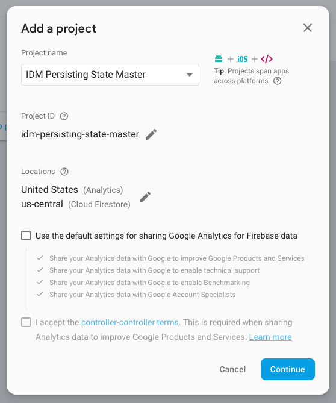
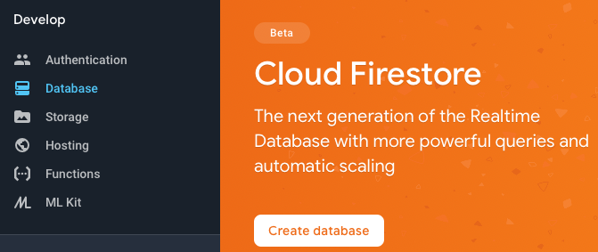
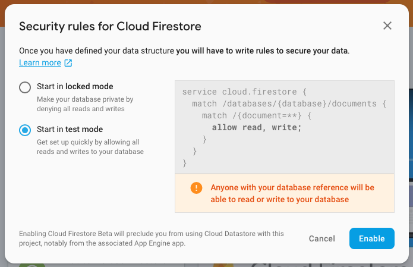
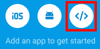
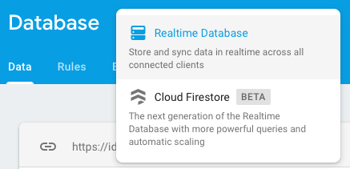
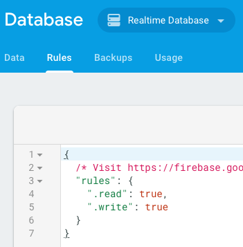

# React Router

## Project Setup

The following steps can be done ahead of time to save time:

1. Setup project

    ```bash
    npm init react-app persisting_state

    cd persisting_state

    rm -rf .git
    rm public/favicon.ico;
    rm public/manifest.json;
    rm src/*
    ```

1. Update `package.json` script

    ```diff
    - "start": "react-scripts start",
    + "start": "BROWSER='Firefox Nightly' react-scripts start",
    ```

1. Copy `.vscode` preferences directory from previous project.
1. Pull starting code from _persisting\_state-start_
1. Update `.vscode/settings.json`

    ```diff
    {
      "files.associations": {
        "**/*.js": "javascriptreact",
    +   "**/js/*.js": "javascript"
      }
    }
    ```

1. Separate public and admin areas in `./src/components/App.js`

    ```diff
    return (
      <>
    +   <div class="app">
    -     <Button myMessage="hello world!" loadSigns={this.loadSigns} />
          <ul className="signs">
            {Object.keys(this.state.signs).map(key => (
              <Sign key={key} details={this.state.signs[key]} />
            ))}
          </ul>
    +     <section className="admin">
    +       <Button loadSigns={this.loadSigns} />
    +     </section>
    +   </div>
      </>
    );
    ```

## Setup Signs Inventory Form

The goal is to create a form that allows us to edit the signs information from the admin side. Let's begin by updating our `./src/components/App.js` App component so that the admin area loads an Inventory component where we'll handle managing the signs information.

This component (which doesn't exit yet) will pass along two functions and our _signs_ data.

```diff
<>
  <div className="app">
    <ul className="signs">
      {Object.keys(this.state.signs).map(key => (
        <Sign key={key} details={this.state.signs[key]} />
      ))}
    </ul>
    <section className="admin">
      <Button loadSigns={this.loadSigns} />
+     <Inventory
+       updateSign={this.updateSign}
+       deleteSign={this.deleteSign}
+       signs={this.state.signs}
+     />
    </section>
  </div>
</>
```

Next, lets create the functions as placeholders.

```javascript
updateSign = () => {
  console.log('update sign');
}

deleteSign = () => {
  console.log('delete sign');
}
```

We'll import the component (which still doesn't exist)

```diff
import Sign from './Sign';
import signs from '../js/signs.js';
+ import Inventory from './Inventory';
```

Create `./src/components/Inventory.js` Inventory component. This component will use another component (_EditSignForm_), which will create an instance of a form for each sign in our data that will allow us to update the information associated with each sign.

```javascript
import React, { Component } from 'react';
import EditSignForm from './EditSignForm';

class Inventory extends Component {
  render() {
    return (
      <div className="inventory">
        <h2>Signs Inventory</h2>
        {Object.keys(this.props.signs).map(key => (
          <EditSignForm
            key={key}
            index={key}
            sign={this.props.signs[key]}
            updateSign={this.props.updateSign}
            deleteSign={this.props.deleteSign}
          />
        ))}
      </div>
    );
  }
}

export default Inventory;
```

Next, create `./src/components/EditSignForm.js` the _EditSignForm_ component base.

```javascript
import React, { Component } from 'react';

class EditSignForm extends Component {
  render() {
    return (
      <div className="sign-edit">
        <p>Edit signs here</p>
      </div>
    );
  }
}

export default EditSignForm;
```

Let's test and see how we're doing.

### Build Edit Form

Update the `./src/components/EditSignForm.js` _EditSignForm_ component to include an input element for the signs _name_

```diff
return (
  <div className="sign-edit">
-   <p>Edit signs here</p>
+   <label htmlFor="name">Name: </label>
+   <input type="text" name="name" value={this.props.sign.name} />
  </div>
);
```

You'll notice now we get an error because we provided a _value_ in our input. The error explains we must also provide an _onChange_ handler that takes care of what happens when the value of the input changes. Let's do that next.

```diff
class EditSignForm extends Component {
+ handleChange = event => {
+   console.log(event);
+ };

  render() {
    return (
      <div className="sign-edit">
        <label htmlFor="name">Name: </label>
-       <input type="text" name="name" value={this.props.sign.name} />
+       <input
+         type="text"
+         name="name"
+         value={this.props.sign.name}
+         onChange={this.handleChange}
+       />
      </div>
    );
  }
}
```

Add remaining form inputs:

```javascript
<div className="controlgroup">
  <label htmlFor="status">Status</label>
  <select
    name="status"
    onChange={this.handleChange}
    value={this.props.sign.status}
  >
    <option value="active">Active</option>
    <option value="inactive">Inactive</option>
  </select>
</div>
<div className="controlgroup">
  <textarea
    name="desc"
    onChange={this.handleChange}
    value={this.props.sign.desc}
  />
</div>
```

### Refactor Variable Names

```diff
render() {
+ const { name, status, desc } = this.props.sign;
return (
  <div className="sign-edit">
  ...

- value={this.props.sign.name}
- value={this.props.sign.status}
- value={this.props.sign.desc}
+ value={name}
+ value={status}
+ value={desc}
```

Each of these inputs will call the `handleChange` function when their values are changed. Add this function to our class. We'll pass in the event that is taking place as a parameter `event`. For now, let's simply log the event information.

```javascript
handleChange = event => {
  console.log(event);
}
```

It's working, but giving us a bit to much information about the event. Let's narrow it down to only the _target_ of the event, which should be only the input who's value is changing.

```diff
handleChange = event => {
- console.log(event);
+ console.log(event.currentTarget);
}
```

We actually only need the new value of the current target, so we can be even more specific:

```diff
handleChange = event => {
- console.log(event.currentTarget);
+ console.log(event.currentTarget.value);
}
```

This should tell us the new value of the input, based on whatever has changed. We can also find out which piece of information is being updated by capturing the _name_ attribute of the input being changed:

```diff
handleChange = event => {
- console.log(event.currentTarget.value);
+ console.log(event.currentTarget.name, event.currentTarget.value);
}
```

So now each time a value is changed, we know what the new value is, and which piece of information is being updated. Now we need to compare the current state of the changing sign with the values coming from the form, and make sure that whatever edits are made in the form are reflected into the current _state_ of the application.

An important note about updating state in React. It is recommended by React that you do not edit (mutate) the state directly. For example, if we're updating the _name_ of the rat sign, we don't want to try to do something like:

```javascript
setState({ sign1.name: 'new value' });
```

Instead, the recommended procedure to update state values is to make a copy of the current state in a new variable, update the value(s) in that copy, and then set the state value to equal the updated variable.

First we create a variable and set its value to be a copy of the state of our sign that's being updated.

```javascript
const updateSign = [];
this.props.sign.forEach(key, value) {
  updateSign.push...
}
```

One way to do this is to setup a loop, and loop through the `props.sign` keys and values, pushing each into our new array. But ES6 has a simpler way for us to do this:

```diff
handleChange = event => {
  console.log(event.currentTarget.value);
  console.log(event.currentTarget.name);

  // Take a copy of the current fish
+ const updatedSign = {
+   ...this.props.sign
+ };
};
```

While we're at it, lets dynamically set the value of the element being updated to our current value. We already know those values, since we're logging them in our function.

```diff
handleChange = event => {
  console.log(event.currentTarget.name, event.currentTarget.value);
+ const name = event.currentTarget.name;
+ const value = event.currentTarget.value;

  const updateSign = {
-   ...this.props.sign
+   ...this.props.sign,
    // ES6 dynamically get the 'name' attribute of the
    // input element that is being updated.
    // [event.currentTarget.name]
    // Then set the value to whatever is entered in that input:
+   [name]: value
  };

  console.log(updateSign);
};
```

Now we have an object that has the updated information based on what changed in the form.

```javascript
console.log(updatedSign);
```

Now we can call our `updateSign` function and send in our new object as a parameter.

```diff
handleChange = event => {
  console.log(event.currentTarget.value);
  console.log(event.currentTarget.name);

  // Take a copy of the current fish
  const updatedSign = {
    ...this.props.sign,
    // ES6 dynamically get the 'name' attribute of the
    // input element that is being updated.
    // [event.currentTarget.name]
    // Then set the value to whatever is entered in that input:
    [event.currentTarget.name]: event.currentTarget.value
  };

  console.log(updatedSign);
+ this.props.updateSign(this.props.index, updatedSign);
};
```

### Update App.js `updateSign` Function

Next we have to write the `updateSign` function in `./src/components/App.js` to update the state. We'll follow the same steps as before to make a copy of the current state and then set the state based on our updated sign parameter.

```diff
- updateSign = () => {
-  console.log('update sign');
+ updateSign = (key, updatedSign) => {
    // 1. copy the current state
+   const signs = { ...this.state.signs }
    // 2. update the state key/value
+   signs[key] = updatedSign;
    // 3. set the new copy to the component state
+   this.setState({ signs: signs })
    // refactor
-   this.setState({ signs: signs })
+   this.setState({ signs })
}
```

### Update Sign.js Status

Let's update `./src/components/Sign.js` our Sign component to use the _status_ property from our state.

```diff
class Sign extends Component {
  render() {
-   const { image, name, desc } = this.props.details;
+   const { image, name, desc, status } = this.props.details;
    return (
-     <li key="this.props.key">
+     <li key="this.props.key" className={status}>
        
        <h2>{name}</h2>
```

We already have a style in our stylesheet that handles a small opacity change for inactive items.

## Setup Persisting State With Firebase

One thing that's a bit annoying is every time we reload the page the data is removed and we have to push the load button. Also, we can make changes to the data, but again once we reload, the changes are gone and we start from our original data again.

We'd like to be able to have the data be persistent so that even after a refresh, the information stays up to date and is displayed automatically. We'll need a database of some sort to keep track of our data as we make edits to our state.

We'll be using a service from Google called [Firebase](https://firebase.google.com). Firebase is pretty easy to get up and running, pretty intuitive for JavaScript developers and it's real time, which means any changes that are made to the data are instant. It uses a technology called web sockets to automatically relay the data to all instances running the app. It allows changes to be made instantly instead of having to use Ajax or ping a database.

When/if you decide to use this service you'll get started by signing up for an account. I'll jump over to my account and get started by creating a new project.



While that's working we'll go back to our project and create a new file called `base.js`. This is not going to be a component. Inside this file we're going to need two packages. This first is called _Rebase_ which is a React, Firebase specific package that will allow us to mirror our state. We also need the official Firebase package which we'll use for anything that is not just mirroring of state.

So first let's install these packages with NPM/Yarn

```bash
npm i --save firebase re-base
```

Then we can create our `base.js` file and import these two packages.

- Create `./src/js/base.js`

```javascript
import Rebase from 're-base';
import firebase from 'firebase';
```

Next we need to configure our app. Let's go back over to our Firebase browser and select our new project. We'll get started by creating a real-time database.



At first, we're going to set the security rules to start in test mode so we can use the database immediately without have to work on authentication. Later we'll go back and change this to make the database secure.



Next we need to get the configuration information to plug into our application. We'll select the _Project Overview_ button from the navigation and then choose the _Web Application_ icon.



We don't need everything, just the object information so we'll copy that and head back to our `./src/js/base.js` file.

```javascript
const firebaseApp = firebase.initializeApp({
  apiKey: "",
  authDomain: "",
  databaseURL: ""
});
```

We'll create a new variable and call `firebase.initializeApp`, and then paste our configuration object into that function. We're really only using the first three so we'll remove the other items in that object.

Next we need to create our _rebase_ so we'll do that:

```javascript
const base = Rebase.createClass(firebaseApp.database());
```

So we created our _Firebase_ app and our binding of that app to the database. Next we need to export each of these.

First we export `firebaseApp` as a named export, so it goes inside curly brackets.

```javascript
export { firebaseApp };
```

We also have a default export, the main thing being exported from this file:

```javascript
export default base;
```

### Sync Database

Next we'll go to our `./src/components/App.js` _App_ component and we need to sync our database with our state once this component is loaded up. We'll be using some of our life cycle methods, specifically the `componentDidMount()` method. Let's start by adding this method to our _App_ component and making sure it's firing. It should fire at the first instant the app is loaded and available.

```diff
class App extends Component {
state = {
  signs: []
};

+ componentDidMount() {
+  console.log('mounted');
+ }

loadSigns = () => {
  this.setState({ signs });
};
```

Let's import our _base_ into the _App_ component:

```diff
import signs from '../js/signs.js';
import Inventory from './Inventory';
+ import base from '../js/base';
```

And we'll create a new reference in our `componentDidMount()` method.

```diff
componentDidMount() {
-  console.log('mounted');
+  this.ref = base.syncState();
}
```

`this.ref` is a Firebase reference we use when we're referencing the database.

We're going to sync this, not with the entire database.

```diff
componentDidMount() {
- this.ref = base.syncState();
  // 'signs' here is the name of the reference
+ this.ref = base.syncState('signs', {
    // Firebase needs a couple pieces of info
+   context: this,
+   state: 'signs'
+ });
}
```

Head back over to Firebase and let's setup the database type and the rules. We going to be using a Realtime Database.



Then, we're going to modify the authentication to allow write access.



## 🎉 Test