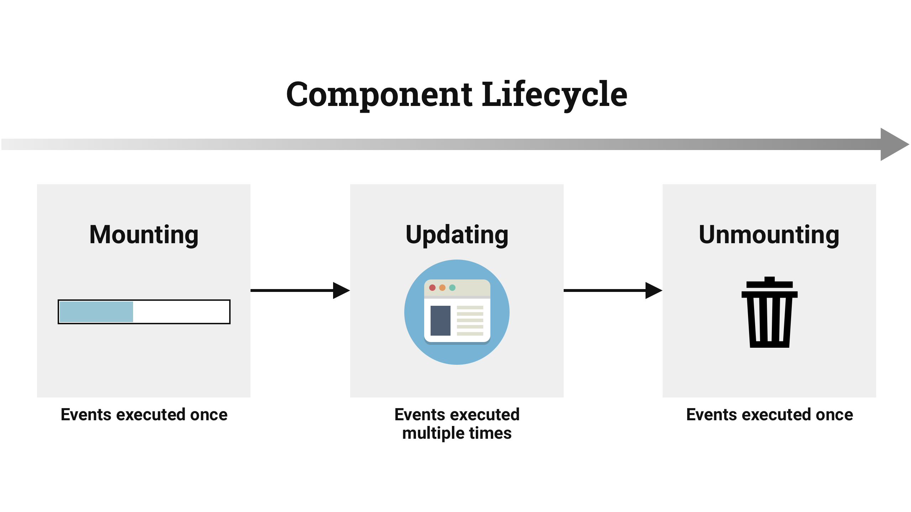

build-lists: true
slidenumbers: true
footer: IDM 364: Introduction to React
autoscale: true
theme: Dark Mode


---

# State

^ Understanding the concept of states in React will allow you to build interesting, robust applications. Without states, your React components are glorified static templates.

---

## React Component States

- mutable
- self contained
- functionality centric

^ A React _state_ is a (_click_) mutable data store of components. The are (_click_) self contained, (_click_) functionality centric blocks of UI and logic.

^ Mutable means state values can change. By using state in a view (`render()`) and changing values later, you can affect the view's representation.

^ When state changes, _only_ the corresponding parts of views change, everything else in the DOM remains intact.

[^1]: Mardan, Azat, and John Sonmez. React Quickly Painless Web Apps with React, JSX, Redux, and GraphQL. Manning, 2016. page 250

---

## Working With States

^ To be able to work with states, you need to know how to access values, update them and set the initial values.

---

### Accessing States

```javascript
this.state.name

render() {
  return <div>{this.state.currentTime}</div>
}
```

^ The `state` object is an attribute of a component that can be accessed with a `this` reference. Recall that we can access and print variables in JSX with curly braces. You can render state just like any other variable in the `render()` method.

---

## State Example

^ Let's build a clock that uses state to update the current time in the view.

^ _03/clock-app_

---

## Updating State

```javascript
this.setState(data, callback);
```

^ You change state with the `this.setState(data, callback)` class method. When you call this method, React merges the data with current states and calls `render()`. After that, React calls `callback`.

^ Having the callback in `setState()` is important because the method works _asynchronously_. If you're relying on the new state, you can use the callback to make sure this new state is available.

^ _return to 03/clock-app_

---

## Stateless Components

^ A _stateless_ component has no states or components. The purpose of a stateless component is to render the view. It can take properties and do something to them. It's a simple function with input and output. We wrote a lot of stateless components in the first few lessons. Let's revisit our Hello World example.

---

### `HelloWorld` Class

```javascript
class HelloWorld extends React.Component {
  render() {
    return (
      <h1 {...this.props}>
        Hello {this.props.frameworkName}
      </h1>
    )
  }
}
```

---

### `HelloWorld` Stateless Component

```javascript
const HelloWorld = function(props) {
  return (
    <h1 {...props}>
      Hello {this.props.frameworkName}
    </h1>
  )
}
```

^ To provide a smaller syntax for stateless components, React uses a function style where you create a function that takes properties as an argument and returns the view.

---

### `HelloWorld` Stateless Component (ES6)

```javascript
const HelloWorld = (props) => {
  return (
    <h1 {...props}>
      Hello {this.props.frameworkName}
    </h1>
  )
}
```

^ You can use ES6 arrow functions for stateless components too.

---

### Stateful vs. Stateless Components

- more declarative
- reduce duplication
- simpler (better) syntax

^ Stateless components are (_click_) more declarative and work better when all you need to do is render HTML. Stateless components (_click_) reduce duplication and provide (_click_) simpler syntax. The React team considers it to be a best practice to use stateless components wherever possible.

---

## Component Lifecycle Events

- mounting events
- updating events
- unmounting event

^ React provides a way for you to control and customize a component's behavior based on its lifecycle events. These events fall into the following categories:

^ mounting events: happen when a React element is attached to a DOM node

^ updating events: happen when a React element is updated as a result of new values of its properties or state

^ unmounting event: happen when a React element is detached from the DOM

---

### Triggering Lifecycle Events

^ Every React component has lifecycle events that are triggered at certain moments depending on what a component has done or will do. Some execute just once, others can be executed continuously.

^ You can use lifecycle events to modify the behaviour of components (for example, decide when to rerender the view). This enhances performance because unnecessary operations are eliminated.

---



^ React defines several component events in three categories. _Mounting_ and _unmounting_ events are invoked once, but _updating_ events can be invoked many times.

---

### Categories of Events - Constructor

^ This diagram does not include the _constructor()_ method, which happens when an element is created and lets you set the default properties and initial state.

---

### Categories of Events - Mounting

- `componentWillMount()`
- `componentDidMount()`

^ `componentWillMount()` happens before mounting to the DOM

^ `componentDidMount()` happens after mounting and rendering

---

### Categories of Events - Updating

- `componentWillReceiveProps(nextProps)`
- `shouldComponentUpdate(nextProps, nextState)`
- `componentWillUpdate(nextProps, nextState)`
- `componentDidUpdate(prevProps, prevState)`

^  `componentWillReceiveProps(nextProps)` happens when the component is about to receive properties

^  `shouldComponentUpdate(nextProps, nextState)` this is a boolean that lets you optimize the component's rendering by determining when to update and when not to update

^  `componentWillUpdate(nextProps, nextState)` happens right before the component is updated

^  `componentDidUpdate(prevProps, prevState)` happens right after the component is updated

---

### Categories of Events - Unmounting

- `componentWillUnmount()`

^ `componentWillUnmount()` lets you unbind and detach any event listeners or do other cleanup work before the component is unmounted.

---

## Implementing An Event

```javascript
class Clock extends React.Component {
  componentDidMount() {
    ...
  }
}
```

^ To implement lifecycle events, you define them on a class as methods. React checks to see whether there's a method with an event name; if React finds a method it will call that method. If the method is not defined, React will continue the normal flow and not execute any code for that method.

---

## Fetch API Example

^ Let's build an example of an app that uses props, state and a component lifecycle method. We'll use the Fetch API which lets us make an XHR request using promises. Let's check browser support _caniuse fetch_.

^ _03/fetch-app_

---

## References

[^1]: Mardan, Azat, and John Sonmez. React Quickly Painless Web Apps with React, JSX, Redux, and GraphQL. Manning, 2016. pages 254, 329-330, 334-337, 375-378, 384-385