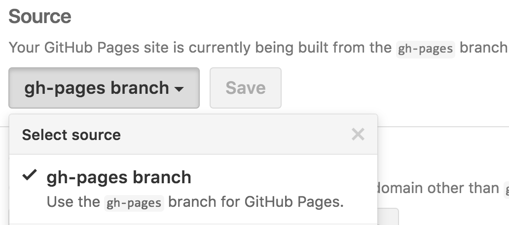

build-lists: true
slidenumbers: true
footer: IDM 364: Introduction to React
autoscale: true
theme: Dark Mode


---

# Build, Deploy & Eject

^ It's time to look now at how we go from a development environment to a production build, and how to deploy our application to a live web server.

---

## Default Tasks

- `npm start`
- `npm test`
- `npm run build`

^ We've been running (_click_) the _start_ command to run the app in development mode, using localhost:3000 to view it in a browser.

^ (_click_) `npm test` runs the test watch in an interactive mode. There's more information about this task online, we're not using it at this point.

^ (_click_) `npm run build` is going to build the app for production in a _build_ folder. It will bundle React in production mode and optimize the build for the best performance. This command gets our app ready to be deployed.

---

[.build-lists: false]

## Deploy

- Azure
- Firebase
- GitHub Pages
- Heroku
- Netlify
- Now
- S3

^ There is a link in the _resources_ document that jumps out to the Create React App deployment documentation, which outlines configuration for all of these different deployment options.

^ Today we'll use GitHub Pages to deploy our app.

---

## Build Task Example

```bash
cd ~/Desktop
npm init react-app my-app

cd my-app
npm run build
```

^ Let's create a sample project and run the _build_ task to create a production build of the default app.

---

### GitHub Repo Setup


^ Next, I'm going to setup a repository for my project. You should already have this in place because you've been using GitHub for source control on your project the entire time you've been developing.

---

### Add `homepage` to `pacakge.json`

```json
"homepage": "https://myusername.github.io/my-app"
```

^ I'm going to edit my `package.json` file to include a _homepage_ field, and the value is going to point to my GitHub page, and then my app name which I'm using for my repository. This is the URL I want to use to deploy my app.

---

### Install `gh-pages`

```bash
npm install --save gh-pages
```

```diff
"scripts": {
+ "predeploy": "npm run build",
+ "deploy": "gh-pages -d build",
  "start": "react-scripts start",
  "build": "react-scripts build",
```

^ Next, install _gh-pages_ and then add two new scripts to the `package.json` file. The `predeploy` script will automatically run before the `deploy` script.

---

### Deploy the Site

```bash
npm run deploy
```

^ Then all we have to do is execute `npm run deploy`, which will deploy our app to the GitHub pages URL we specified.

---

### Verify Deployment



To ensure the project settings are correct, go the the settings for the repository and verify the project settings is set to use the `gh-pages` branch.

---

### Design, Develop, Deploy

- develop and commit changes
- `npm run build`
- `npm run deploy`

---

[.build-lists: false]

## ⚠️ Eject

- `npm run eject`

^ If you aren't satisfied with the build tool and configuration, you can `eject` the app at any time. This will copy all of the configuration files into your project so you have control over them.

^ You don't have to use `eject`, but it's an option if you need to customize your project configuration. This is a one way operation. Once you `eject`, you can't go back.